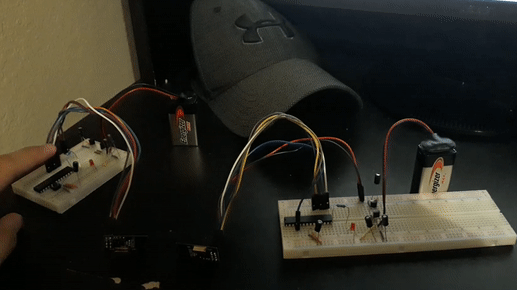

# nrf-demo
Configuring the popular nRF24L01 tranceiver module to communicate between two AVRs through the SPI protocol. Includes a handy C library for the ATmega328P. The module,
through SPI, allows MCUs to communicate and exchange data wirelessly.

## C library
Despite the initial complexities in learning to self code an SPI library, I succeeded in creating something that can be utilized in various other projects and not limited
to this small demonstration. Under the lib directory is the header file and the corresponding source code. If you were to use this library and customize the code to meet 
demands of other projects, I would suggest only touching the RX/TX_Setup function in the source file. My main purpose in using this RF module in the first place is to test
out wireless communication in AVR for usage in collecting remote sensor data. As such I have only included a unidirectional communication between TX and RX. However, you
can easily create a version of the library that can handle transmission going both ways by utilizing the helper functions I created and checking out the data sheet. Also, 
if you want to customize the pinouts (CSN and CE), edit them in the header file.

## nRF24L01
Rather inexpensive, but impressive and featureful 2.4GHz RF tranceiver module that has become apparently popular in the hobbyist domain. For the full list of specification and
documentation, view the [datasheet].  (https://www.sparkfun.com/datasheets/Components/nRF24L01_prelim_prod_spec_1_2.pdf). 

## demonstration
The demo shows me pressing a button on the transmitter board (left) that triggers an LED on the receiver board (left) wirelessly using the modules. Note that I had to use
voltage regulators on the left side of each board to bring down the 9V down to 5V and 3.3V for the ATmega328P and the nRF24L01, respectively. Otherwise, the wiring on the 
board is simple and self-explanatory. 
